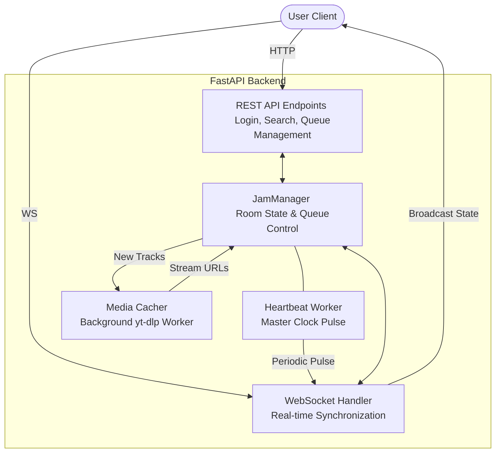

# Jam_bo

Jam_bo is a real-time synchronized media playback platform designed for collaborative jam sessions. It allows multiple users to join a room and listen to/watch the same content in perfect synchronization, regardless of when they join or their network conditions.

## Key Features

- Real-Time Synchronization: A server-side heartbeat (PULSE) mechanism ensures all clients maintain the same playback position.
- Shared Queue Management: Any user in a room can add, remove, or skip tracks in the collective queue.
- Optimized Streaming: Automatically fetches and caches YouTube streams at 360p resolution to ensure stability and low latency across various internet speeds.
- Multi-Room Support: Create or join specific rooms for isolated jam sessions.
- Simple Authentication: Basic user-based login system to manage sessions.

## Backend Architecture



## Technology Stack

### Backend
- Framework: FastAPI (Python)
- Real-Time: WebSockets for low-latency state synchronization.
- Media Processing: yt-dlp for fetching and optimizing media streams.
- Environment: Python 3.10+

### Frontend
- Framework: React with Vite
- Communication: WebSocket client for real-time updates.
- Styling: Vanilla CSS.

## Getting Started

### Prerequisites
- Python installed on your system.
- Node.js and npm installed.
- yt-dlp installed (available via pip).

### Backend Setup
1. Navigate to the backend directory:
   ```bash
   cd backend
   ```
2. Create and activate a virtual environment:
   ```bash
   python -m venv venv
   source venv/bin/activate  # On Linux/macOS
   ```
3. Install dependencies:
   ```bash
   pip install -r ../requirements.txt
   ```
4. Start the server:
   ```bash
   uvicorn main:app --reload --host 0.0.0.0 --port 8000
   ```

### Frontend Setup
1. Navigate to the frontend directory:
   ```bash
   cd frontend
   ```
2. Install dependencies:
   ```bash
   npm install
   ```
3. Start the development server:
   ```bash
   npm run dev
   ```

## Configuration

Create a .env file in the root directory with the following variables:
- APP_USERS: A JSON string mapping usernames to passwords (e.g., '{"user1": "pass1"}').

## Project Structure

- /backend: FastAPI server logic, WebSocket management, and media handling.
- /frontend: React application source code and assets.
- /requirements.txt: Python dependencies for the backend.
